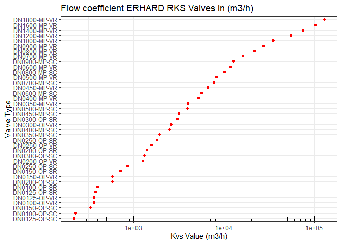

<!-- README.md is generated from README.Rmd. Please edit that file -->

``` r
library(tidyverse)
#> -- Attaching packages --------------------------------------- tidyverse 1.3.1 --
#> v ggplot2 3.3.5     v purrr   0.3.4
#> v tibble  3.1.5     v dplyr   1.0.7
#> v tidyr   1.1.4     v stringr 1.4.0
#> v readr   2.0.2     v forcats 0.5.1
#> -- Conflicts ------------------------------------------ tidyverse_conflicts() --
#> x dplyr::filter() masks stats::filter()
#> x dplyr::lag()    masks stats::lag()
library(scales)
#> 
#> Attaching package: 'scales'
#> The following object is masked from 'package:purrr':
#> 
#>     discard
#> The following object is masked from 'package:readr':
#> 
#>     col_factor
```

# pvErhard

<!-- badges: start -->
<!-- badges: end -->

Provide the data necessary to calculate the Erhard RKV valves.

## Installation

You can install the development version of pvErhard like so:

``` r
remotes::install_github("ratral/pvErhard")
```

## Zeta *ζ* and flow coefficient *K*<sub>*v**s*</sub> values of the ERHARD RKS Valves at a fully-open valve

The *K*<sub>*v**s*</sub> value expresses the amount of flow in a
regulating valve at a fully-open valve position and a pressure
differential of 1 bar. The *K*<sub>*v**s*</sub> value is a special case
of the *K*<sub>*v**s*</sub> value, which indicates the flow at a given
valve position and a pressure differential of 1 bar.

``` r
library(pvErhard)
```




